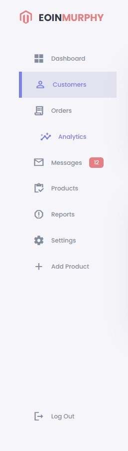

# Responsive-Website
A fully responsive website design using HTML, CSS, and Javascript.
The objective of this site is to demonstrate my ability and skill with UX/UI
---
This project has a simple and sleek design showing some basic information that would be useful to an E-Commerce website Admin.

On the left of the page is the menu with buttons to the relevant sections with some sleek and quick animations and styling.
The right side of the page has a toggle for light/dark theme, a greeting message to the user, a section for recent orders, and a section for sales analytics.

                     

The Center of the page is an overview of Sales, Expenses and Total Income and below that, some recent orders that have been placed showing the product name/number, the status of the payment and order.

The toggle for light/dark theme is located on the top right of the page 

## [View the deployed website here!](https://5500-e01nmurphy-responsivewe-39lgm6r70m6.ws-us101.gitpod.io/)

